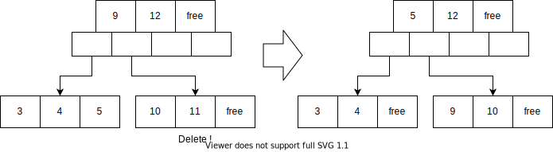

# RDBMSの**B-tree**インデックス

heriet

---

# 今日話すこと

- RDBMSと検索（探索）の基礎
- B-treeの基礎
- RDBMSのB-treeインデックス

---

# RDBMS

- DBMS (DataBase Management System)
    - データベースを取り扱うシステムのこと
- RDBMS (**Relational** DMBS)
    - 行指向でACID特性を満たす（事が多い）DBMS
    - 要はMySQLとかPostgreSQLみたいなやつ
    - 分脈によってはこれを単にデータベースと呼ぶ
- RDBMSの主な仕事
    - **大量のデータを効率よく永続化する**
    - **大量のデータを効率よく検索する**
    - ACID特性を保つ

※ もちろん、RDBMSの仕事はRDBMSの特性によって異なる

---

# 永続化（Persist）

- 大抵のことが起きても保存したデータを再度取り出せる状態にすること
    - 大抵のこと
        - プロセスが急に殺される
        - マシンの電源が急に落ちる
        - ディスクのI/Oが急に止まる
- 現代のデータベースにおいて、永続化装置には**HDD/SSD**が用いられるのが普通
    - 不揮発だから
        - 将来、NVRAMが広く実用化されたら事情が変わるかもしれない
    - 安価だから
    - 枯れてるから

---

# ブロックデバイス

- 一定の大きさ（ブロック）ごとに読み書きできるデバイス
    - たとえば1ブロック 512 byte とか
- HDD/SSDもブロックデバイスの一種
- 通常、ブロックデバイスを操作するのはOSのファイルシステムの仕事
    - が、DBMSにおいては、性能向上のために**ブロックデバイスを直接操作**することも多い
        - DBMSの性能のボトルネックはだいたいI/Oだから

DBMSはブロックデバイス上に永続化したデータを効率よく**検索**したい

---

# 検索（探索）

- 大量のデータ集合から、条件にマッチするデータの部分集合を得る操作
    - いわゆる情報科学でいうところの探索
- 効率のいい探索とは？
    - **計算量が小さい**探索が効率のいい探索
- アルゴリズムの計算量
    - **時間計算量**（Time complexity）
        - データ量に対して増える処理時間が増える量
    - **空間計算量**（Space complexity）
        - データ量に対して必要な記憶領域が増える量

---

# 探索の例: 線形探索（Linear Search）

最初から最後まで一つずつ比較する方法

- 最良時間計算量は *O(1)*
    - 上記の例だと 3 を探索するとき 
- 最悪時間計算量は *O(n)*
    - 上記の例だと 8 を探索するとき 
- 平均時間計算量は *O(n/2)*
    - i番目の探索コストがiなので
- 空間計算量は *O(1)*
    - データ以外に記憶領域を使わないので

---

# 探索の例: 二分探索（Binary Search）

ソート済みのリストを中央の値から大小比較する方法

説明が面倒くさいのでWikipediaでも読んでください

https://ja.wikipedia.org/wiki/二分探索

要はソート済みのデータを用意すれば、大小比較で高速に探索できるよねという話

see [Binary and Linear Search Visualization](https://www.cs.usfca.edu/~galles/visualization/Search.html)

---

# RDBMSが取り扱うデータの性質

- データの**数が沢山**ある
    - nが大きいので線形探索では効率が悪い
- データの**サイズが可変**
    - つまり、データの開始位置がメモリアドレス上で計算不可
    - 二分探索で単純にアドレス計算はできない
- データを**更新**したり**削除**することがある
    - データがソートされた状態を維持するにはコストがかかる

上記の性質を持つデータを、効率よく保存し、かつ高速に検索するにはどうすればよいだろう？

少なくとも、データを検索するためには、配列より高度な**データ構造**が必要

---

# 二分探索木（BST）

- 左の子 ≦ 親 ≦ 右の子 を常に満たす**二分木**
    - 木構造で子が2つのものが二分木。二部探索木は二分木の一種
- 木構造を追うことで二分探索出来る
    - 5を探索するコストは3
- see [Binary Search Tree Visualization](https://www.cs.usfca.edu/~galles/visualization/BST.html)

---

# 偏った二分探索木

- 偏ってしまうと線形探索と変わらない状態になってしまう。困る
    - 5を探索するコストは5

---

# 二分探索木のバランシング（ピボット）

- ノード挿入または削除時に、2ノードが連続して子を持たないとき**ピボット**させる
- ピボット
    - 中心のノードを親に昇格し、前後のノードをそれぞれ子にする
- バランシングにより平衡な状態を保った二分探索木を**平衡二分探索木**という

---

# 二分探索木の問題点

- ファンアウト（1つのノードが保持可能な子の最大数）が2であり小さい
    - バランシングが頻繁に発生してしまう
    - RDBMSにおいて隣接ノードの物理的な局所性が保ちにくい
- 木が深くなる（logN）
    - 子ノードをたどる回数が多くなる = RDBMSにおいてディスクシーク回数が多くなる

ファンアウトと木の深さは反比例するので、ファンアウトを増やせば良い

---

# B-tree

- 1つのノードが**最大N個の値**を持ち、**最大N+1個のポインタ**を保持する
    - i番目のポインタはi番目の値より小さい値を持つ子を指す
    - i+1番目のポインタはi番目の値より大きい値を持つ子を指す
- ソート済みの平衡木
    - **スプリット**や**マージ**、**リバランス**により平衡状態が保たれる
- B-treeのファンアウトが2のときは**平衡二分探索木**
- see [B-Tree Visualization](https://www.cs.usfca.edu/~galles/visualization/BTree.html)

---

# B-treeのスプリット

- 挿入操作を行ったとき、対象ノードの空きがない場合に**スプリット**を行う
    - ノードを1つ追加し、半分を新規ノードに移す操作
        - 実装によってはノードの利用率を高めるため、1ノード追加し3ノードで2/3の値を配分することも
- スプリットにより親ノードの空きがない場合は、親ノードもスプリットする

---

# B-treeのマージ

- 削除操作を行ったとき、対象ノードの値が少なく、隣接ノードに収まる場合に**マージ**を行う
    - 隣接ノードに値を移動させる
- マージにより親ノードの値が少なくなった場合は、親ノードもマージする

- 値が少ないが、隣接ノードに移せない場合は**リバランス**（次ページ）

---

# B-treeのリバランス

- 挿入や削除操作を行ったとき、隣接ノードと値の数が同程度になるように**リバランス**する

- 適度にリバランスがなされていると、スプリットやマージ回数が減らせる
    - リバランスをしすぎるとそれはそれでコストなので、頻度は実装次第

---

# RDBMSのデータファイルとインデックスファイル

- データファイル
    - 保存したいの行のデータを格納するファイル
    - 格納順序の制約がないデータファイルは**ヒープ**（ヒープテーブル）とも呼ばれる
        - ヒープじゃないデータファイルもありますが、今回は割愛
- インデックスファイル
    - データファイルの検索用メタデータを保持するファイル
    - インデックス用のキーと、データファイル上のデータの実際の位置を保持する
    - RDBMSでは **B+tree** のインデックスが使われることが多い
        - RDBMSの文脈ではB+treeのことをB-treeということも多い

---

# B+tree

- B-treeの亜種の一つで、値をリーフノード（Leaf Node）のみが持つもの
    - ルートノード（Root Node）と中間ノード（Internal Node）が持つのはセパレートキー
- see [B+ Tree Visualization](https://www.cs.usfca.edu/~galles/visualization/BPlusTree.html)

---

# B+treeとSliblingポインタ

- RDBMSの実装では、更にノードにSliblingポインタをもたせることが多い（双方向または単方向）
    - 隣のリーフノードへのポインタ
- B+treeにSliblingポインタを追加すると、リーフノードをまたぐ探索時に親を読む必要がなくなる
    - B-treeだと親ノードの値を都度読む必要があり、ブロックデバイスのI/O的に非効率になる

---

# ヒープとB-treeインデックス

- データ（レコード行）追加順にヒープにデータが追加され、インデックスがデータの開始位置を保持する

---

# ページ

- RDBMSでインデックスを扱う場合、各ノードは固定長（ブロックサイズの整数倍）にすることが多い
    - I/O効率が最も良いので
    - この文脈ではノードのことを**ページ**とも呼ぶ
    - RDBMSはページ単位で各種I/O処理を行う
- ページのサイズが決まれば、自ずと各ノードが保持可能なキーの数が決まる
    - ページサイズが大きければ1ノードにキーをたくさん保持できる
        - データ数が多い場合は、ページサイズが大きいほうが処理効率がいい
        - 逆に、データ数が少ない場合は、ページが大きいと無駄な記憶領域を消費する
- RDBMSの実装上は、ページにはキーとポインタ以外にも**管理上のメタデータ**も持つことになる

---

# B+treeインデックスの実装（PostgreSQL）

https://www.postgresql.org/docs/12/storage-page-layout.html

- PostgreSQLでは1ページが8192byte
- Special spaceにSliblingポインタなどインデックスに必要な様々な情報が詰まっているらしい

---

# PostgreSQL ファストパス

- AUTO INNCREMENTなど値が単調増加する場合の最適化の一つ
- 挿入する最も右端のノードを保持しておき、ルートノードや中間ノード探索をスキップする
    - [postgres/nbtinsert.c](https://github.com/postgres/postgres/blob/bf491a9073e12ce1fc3e6facd0ae1308534df570/src/backend/access/nbtree/nbtinsert.c#L127-L144)

---

# まとめ

- **B-tree（B+tree）** は探索に適したデータ構造の一つ
- 多くのRDBMSはB-tree（B+tree）でインデックスを作成することで検索効率向上を図っている
- 基本的な理論はB-treeだが、RDBMSの要件に合わせて**様々な最適化実装**がある
    - そのへんの細かくて難しい話は今回紹介しきれてないがまあもっとたくさんある

---

# 参考文献

- 全般
    - [詳説 データベース](https://www.oreilly.co.jp/books/9784873119540/)
        - 今日話したことはだいたいこの本に載ってる。もっと難しい話も。誰か輪読会して欲しい
- PostgreSQL
    - [Database Page Layout](https://www.postgresql.org/docs/12/storage-page-layout.html)
    - [［改訂新版］内部構造から学ぶPostgreSQL 設計・運用計画の鉄則](https://gihyo.jp/book/2018/978-4-297-10089-6)
    - [The Internals of PostgreSQL : Chapter 1 Database Cluster, Databases, and Tables](https://www.interdb.jp/pg/pgsql01.html)
    - [Indexes in PostgreSQL — 4 (Btree) : Postgres Professional](https://postgrespro.com/blog/pgsql/4161516)
    - [PostgreSQL's indexes – BTrees internal data structure](http://www.louisemeta.com/blog/indexes-btree/)
- MySQL
    - [InnoDB page Header](https://dev.mysql.com/doc/internals/en/innodb-page-header.html)
    - [実践ハイパフォーマンスMySQL 第3版](https://www.oreilly.co.jp/books/9784873116389/)
- [Data Structure Visualization](https://www.cs.usfca.edu/~galles/visualization/Algorithms.html)
    - 今回紹介したデータ構造可視化以外にもたくさんあるので遊んでみよう
